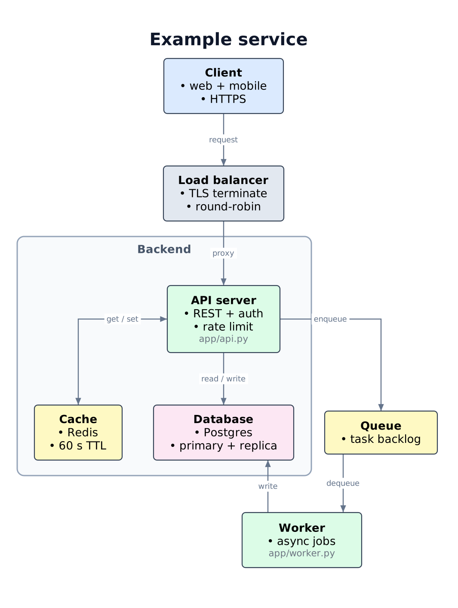
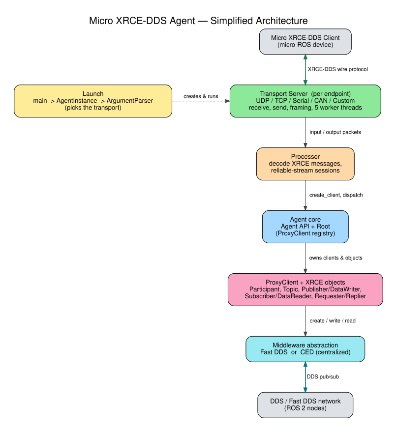
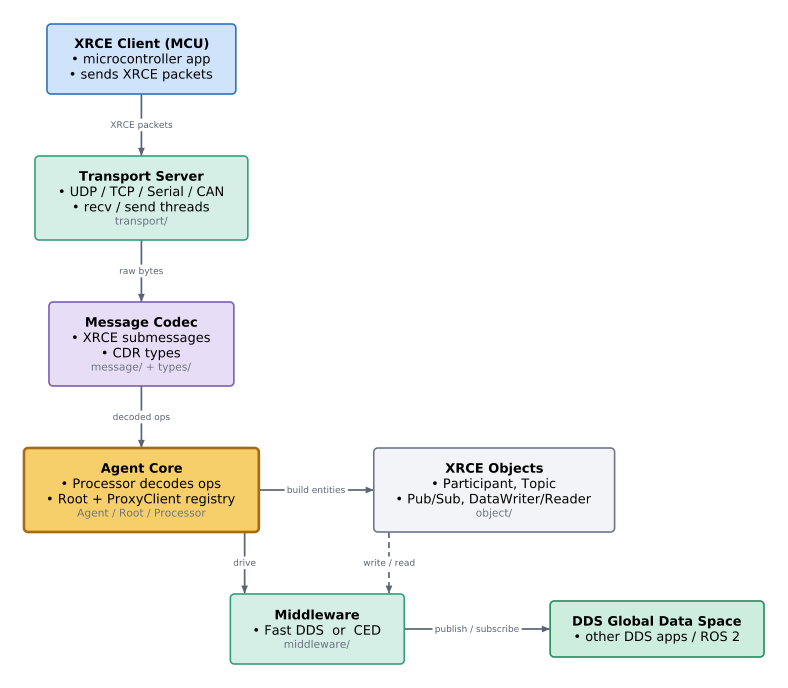
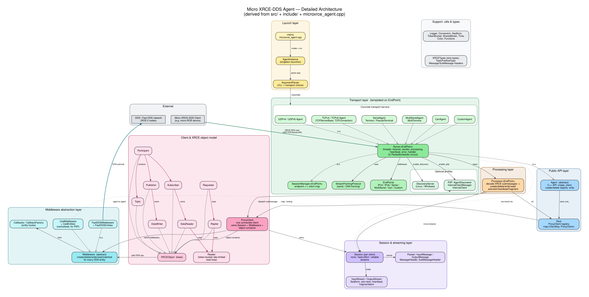
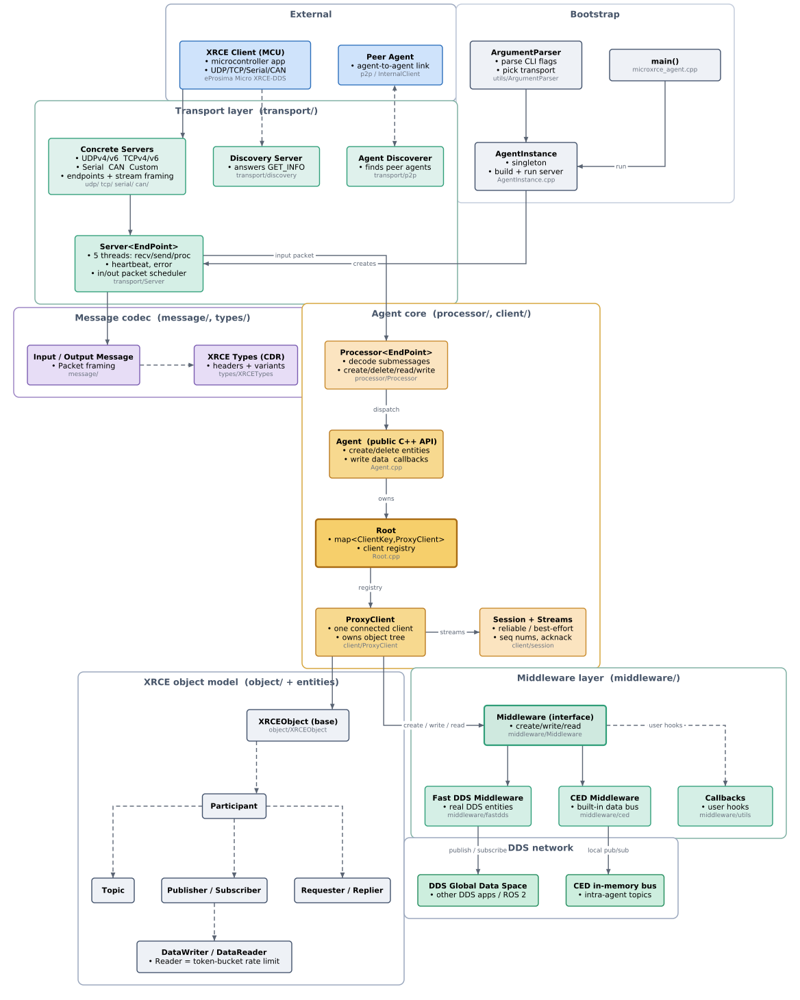

# diagram-authoring

***NOTES*:   
A. Some of the README.md has been written by Claude. I edited it to explain my intent, but the dry details are the same  
B. A/B Testing to measure Slide Quality & Token Costs will be added this week (with/without rtk & the skill)**  

<br></br>
A Claude Code / Claude Agent **skill** that authors slide-grade architecture and flow diagrams from a
codebase or a spec. Graphviz computes the layout; cairo draws it.  
output is an outlined SVG plus a PNG, with clean orthogonal lines, every label centered on its line, and Canva-safe colors.



*(the example above is produced by `skill/gvcairo.py` from [`examples/service.dot`](examples/service.dot) — no hand editing)*

## Why

Claude is a fucking idiot - ask him to make slides by crawling through a repo (because you're lazy, don't lie to yourself)  
and he produces hot & steamy garbage that can't be easily fixed. Not only that,   
using Graphviz as is forces it into a bad trade: orthogonal lines **or** centered edge labels, never both. Slide
tools then choke on graphviz SVG - live `<text>` shifts with fonts, and percentage `rgb()` colors
break Canva. This skill fixes all the shenanigans related to that.  
It keeps graphviz's clean geometry, draws the labels itself on the
middle of each line, outlines all text to paths (zero `<text>`), and emits hex colors.

## What you get

- **Clean orthogonal routes**, with each route re-centered in its free channel so it never hugs a box.
- **Every label on its line**, as a white chip placed to avoid collisions.
- **Cluster boxes, bold titles, dim `~annotation` lines, reversed arrows.**
- **Tool-proof SVG**: zero `<text>` elements, so no font can move a label.
- **Canva-safe**: hex colors, rounded coordinates.
- **A verifier** that measures margins, overflow, aspect, and ink — you render blind, so numbers are
  your eyes.

## Install

Copy the `skill/` folder into your skills directory:

```
cp -r skill ~/.claude/skills/diagram-authoring
# or, per-project:
cp -r skill <your-repo>/.claude/skills/diagram-authoring
```

Requirements on the machine that renders:
- `dot` (graphviz)
- `python3` with the packages in `requirements.txt` (`pycairo`, `Pillow`, `numpy`) — `pip install -r requirements.txt`
- a TrueType font — DejaVu Sans by default; override with the `DIAGRAM_FONT` env var. No inkscape / rsvg / cairosvg / chromium needed.

## Quickstart

```
python3 skill/gvcairo.py  my.dot  out        # writes out.svg + out.png (+ out.routes.json)
python3 skill/check.py    my.dot  out.png    # margins, overflow, aspect, ink — as numbers
python3 skill/clean_svg.py out.svg           # rgb(%) -> hex, round coords (Canva-safe)
```

Author the `.dot` with `rankdir=TB, splines=ortho, compound=true`. Put edge text in `label=`; the
renderer places it. Group nodes into `subgraph cluster_*`. See [`examples/service.dot`](examples/service.dot).

## The tools

| file | role |
|------|------|
| `skill/gvcairo.py`   | graphviz layout → cairo outlined render: clusters, bold titles, dim `~` annotations, reversed arrows, channel-centered routes, chip labels |
| `skill/check.py`     | verifier: edge-to-node margins, text overflow, stacked lines, chip collisions, aspect, PNG ink |
| `skill/clean_svg.py` | `rgb(%)` → hex and coordinate rounding, for Canva |
| `skill/pin.py`       | optional layout pinner for dense, cluster-heavy diagrams |
| `skill/SKILL.md`     | the full method the agent follows |

## Box-design rules the skill enforces

- One role per box. A clear title, then only crisp detail.
- Several facts become a **list** (one `•` per line), never a run-on sentence. At most 3–4 lines.
- Title by role, not by source file. A filename may appear as ONE dim `~` line.
- "Detailed" means more boxes and more facts — not fuller boxes. It must still read at a glance.

## Benchmark: does the skill actually help?

`benchmark/run_ab.sh` runs a controlled A/B on a real repo: the same crawl agent, same model, same
task — the only difference is whether the skill is present.

```
./benchmark/run_ab.sh <model-id>      # e.g. claude-opus-4-8
```

It hides the skill from the agent's skill dirs for the baseline arm (a headless agent will otherwise
discover and use it), asserts the isolation, pins the model, then runs the with-skill arm. Each arm
writes a `run.json`; parse it for turns and token usage. See [`benchmark/README.md`](benchmark/README.md).

**Result (2026-09-16, Opus 4.8, one repo, one run per arm).** Target: the OSS
[Micro-XRCE-DDS-Agent](https://github.com/eProsima/Micro-XRCE-DDS-Agent). The with-skill diagrams were
substantially cleaner and more readable. The skill is a quality lever, not a token saver: it costs more
because the agent invokes it and runs the full render -> measure -> clean -> verify -> iterate loop.

### Token usage (from each arm's `run.json`)

| metric | baseline (no skill) | with skill |
|---|---:|---:|
| turns | 21 | 54 |
| input tokens | 32 | 86 |
| output tokens | 13,637 | 46,808 |
| cache-create tokens | 107,213 | 123,728 |
| cache-read tokens | 1,130,341 | 4,202,573 |
| **total tokens (incl. cache)** | **1,251,223** | **4,373,195** |
| cost (USD) | $1.98 | $4.51 |
| wall time | 199 s | 726 s |

### Before / after

Rendered by each agent with no hand editing. Shown as SVG, so it stays crisp at any zoom.

**Simplified**

baseline (no skill):



with skill:



<br><br>

**Detailed**

baseline (no skill):



with skill:



<br>

Caveats: n = 1 per arm — a single repo and a single run; quality is a visual judgment, not an automated
score. Isolation is verified: the baseline never invoked the skill (0 Skill calls, no `gvcairo`, no
`routes.json` in its output). Raw usage is in `benchmark/results/*-run.json`.

## License

MIT. See [LICENSE](LICENSE).
